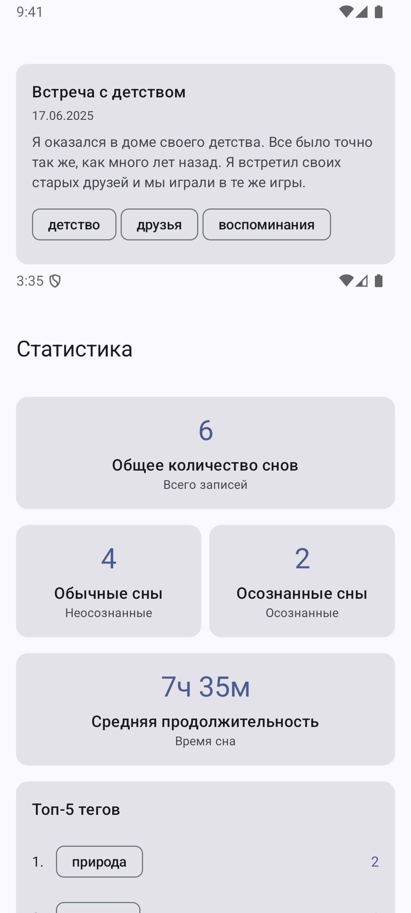
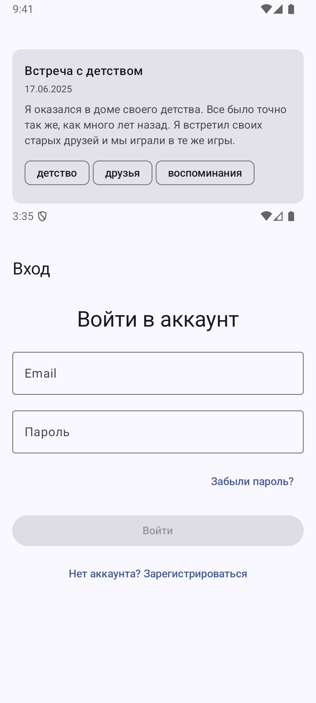
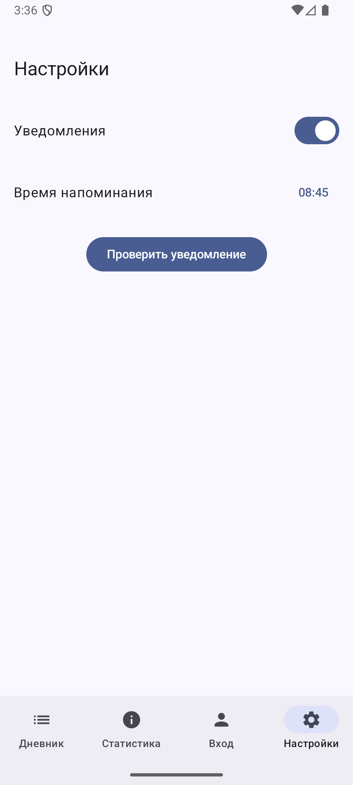

# Журнал снов
Разработка мобильного приложения «Дневник снов» для операционной системы Андроид на языке Котлин

## **Основной функционал приложения:**

### **Главный экран:**

Содержит **нижнее навигационное меню** с четыремя пунктами:

#### **1. Дневник**

Отображение списка снов в виде одной колонки, снизу справа есть кнопка добавления сна. По нажатию на элемент открывается **экран просмотра сна**.  
**Поля записи сна:**

  * Дата сна
  * Время начала
  * Время окончания
  * Название сна
  * Содержимое (текстовое описание)
  * Теги (множественные)
  * Осознанность сна (флаг: да/нет)

#### **2. Статистика**

Отображение аналитики по снам:

* Общее количество снов
* Количество обычных и осознанных снов
* Средняя продолжительность сна
* Топ-5 часто встречающихся тегов (по частоте использования)

#### **3. Авторизация и регистрация**

* Использование Firebase (email + пароль)
* Проверка и сохранение статуса авторизации

#### **4. Настройки**

* Включение / отключение уведомлений
* Настройка времени напоминания о записи сна

---

## Демонстрация работы приложения








---

## Инструкция по подключению FIREBASE

### Шаг 1: Создание проекта Firebase
1. Перейдите на [Firebase Console](https://console.firebase.google.com/)
2. Нажмите "Создать проект"
3. Введите название проекта (например, "DreamApp")
4. Отключите Google Analytics (опционально)
5. Нажмите "Создать проект"

### Шаг 2: Добавление Android приложения
1. В консоли Firebase нажмите на иконку Android
2. Введите Package name: `com.example.dreamapp`
3. Введите App nickname: "DreamApp"
4. Нажмите "Зарегистрировать приложение"

### Шаг 3: Загрузка google-services.json
1. Скачайте файл `google-services.json`
2. Поместите его в папку `app/` вашего проекта
3. **ВАЖНО**: Не добавляйте этот файл в Git (он уже в .gitignore)

### Шаг 4: Настройка Authentication
1. В консоли Firebase перейдите в "Authentication"
2. Нажмите "Начать"
3. Выберите "Email/Password"
4. Включите:
   - "Email/Password"
   - "Email link (passwordless sign-in)"
5. Нажмите "Сохранить"

### Шаг 5: Настройка Firestore
1. В консоли Firebase перейдите в "Firestore Database"
2. Нажмите "Создать базу данных"
3. Выберите "Начать в тестовом режиме"
4. Выберите ближайший регион (например, "europe-west3")
5. Нажмите "Готово"

### Шаг 6: Настройка правил безопасности Firestore
1. В консоли Firebase перейдите в "Firestore Database" → "Правила"
2. Замените правила на:

```rules
rules_version = '2';
service cloud.firestore {
  match /databases/{database}/documents {
    // Пользователи могут читать и записывать только свои данные
    match /users/{userId} {
      allow read, write: if request.auth != null && request.auth.uid == userId;
      
      // Сны пользователя
      match /dreams/{dreamId} {
        allow read, write: if request.auth != null && request.auth.uid == userId;
      }
    }
  }
}
```
